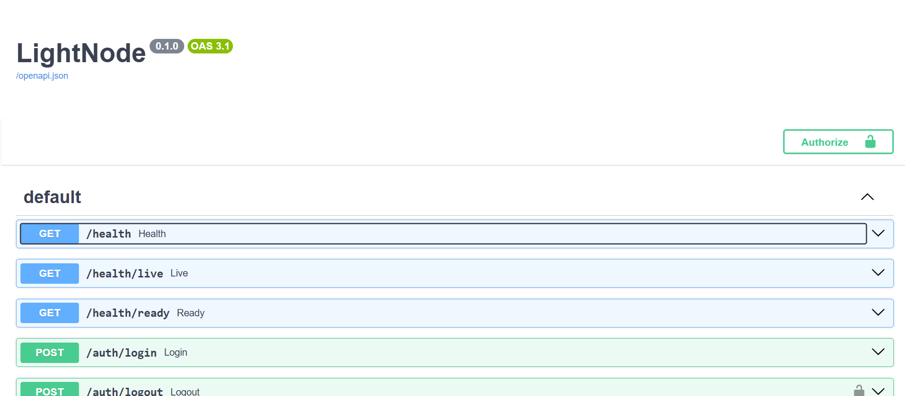
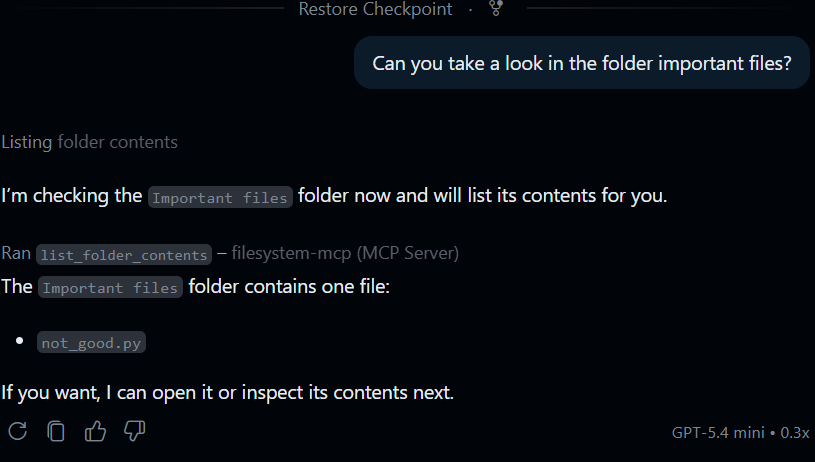
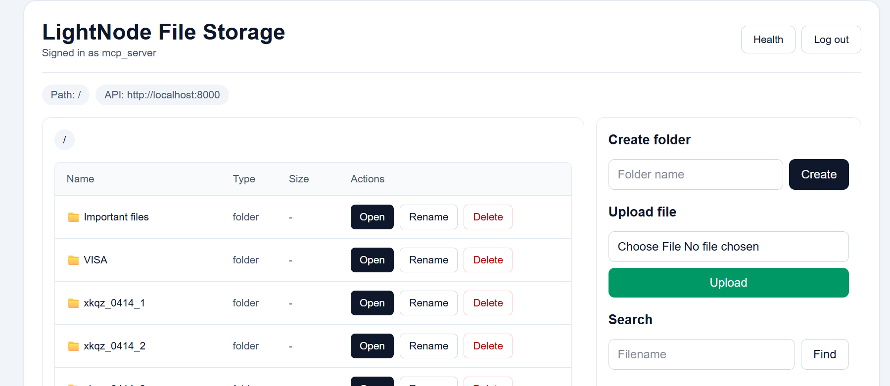
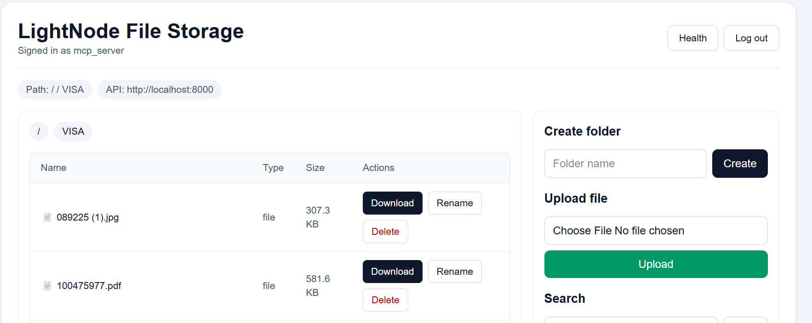

# LightNode

## Project Description
LightNode is a storage-first, self-hosted file service designed for single-node Raspberry Pi class hardware. The core goal is to let users keep ownership of data while still exposing modern API-based access for applications, web clients, and AI tooling.

This repository contains the core runtime service responsible for:
1. storage bootstrap and validation
2. metadata persistence
3. authentication primitives
4. host-side administration
5. API behavior and auditing

## System Architecture Overview
LightNode uses a Microkernel architecture.

### Core Service (this repository)
1. API layer for health, auth, folder, and file endpoints
2. storage service that validates external-drive readiness
3. SQLite metadata storage on the same drive as file payloads
4. audit trail for protected operations
5. host-only admin CLI for account and token operations

### Companion Extensions (separate repositories)
1. web interface extension for user-facing access
2. MCP server extension for AI/tool integration

### High-Level Flow
1. initialize storage root
2. start API and validate readiness
3. create user and token through admin CLI
4. call protected endpoints with bearer token
5. persist metadata and audit records

## User Roles and Permissions
Current system actors and access model:

1. Admin (console)
- create user accounts
- reset passwords
- activate or deactivate users
- create, list, and revoke tokens
- initialize and inspect storage

2. Authenticated User (API or UI)
- access protected routes using a valid token
- perform available file and folder operations exposed by the core API

3. AI or Extension Identity (MCP context)
- access core features through extension integration paths
- carry extension identity for accountability in logs

Limitation note:
The current core does not claim complete strict role-permission enforcement for three fully independent authorization roles at endpoint granularity. This is documented as a known hardening area.

## Technology Stack
1. Python 3.12+
2. FastAPI
3. Uvicorn
4. SQLite
5. Pydantic v2
6. Pytest
7. GitHub Actions for automated test runs

## Installation and Setup Instructions
### 1. Prerequisites
1. Python 3.12 or newer
2. pip
3. writable storage path

### 2. Clone the repository
```powershell
git clone <your-repository-url>
cd LightNode
```

### 3. Create and activate a virtual environment
Windows (PowerShell):
```powershell
py -m venv .venv
.\.venv\Scripts\Activate.ps1
```

Linux or macOS:
```bash
python3 -m venv .venv
source .venv/bin/activate
```

### 4. Install dependencies
```powershell
python -m pip install --upgrade pip
python -m pip install -e .[dev]
```

### 5. Configure environment file
Windows:
```powershell
copy example.env .env
```

Linux or macOS:
```bash
cp example.env .env
```

Set `LIGHTNODE_STORAGE_ROOT` in `.env` if you want a custom storage path.

## How to Run the System
### 1. Initialize storage
Windows:
```powershell
python -m lightnode storage init --root E:\lightnode-storage
```

Linux:
```bash
python -m lightnode storage init --root /srv/lightnode/storage
```

### 2. Inspect storage
Windows:
```powershell
python -m lightnode storage status --root E:\lightnode-storage
```

Linux:
```bash
python -m lightnode storage status --root /srv/lightnode/storage
```

### 3. Start the API service
```powershell
python -m uvicorn --app-dir src --host 0.0.0.0 --port 8000 --env-file .env lightnode.app:app --reload
```

API docs:
1. http://127.0.0.1:8000/docs

### 4. Create user and token
```powershell
python -m lightnode admin user create --root E:\lightnode-storage --username alice --password secret123
python -m lightnode admin token create --root E:\lightnode-storage --username alice
```

### 5. Call a protected endpoint
```bash
curl -H "Authorization: Bearer <your_token>" http://localhost:8000/auth/me
```

### 6. Run tests
```powershell
py -m pytest -q
```

## Screenshots of the System

### API Documentation


### MCP Server


### Web App




## Extension Repositories
1. [LightNodeMCPServer](https://github.com/knilios/LightNodeMCPServer)
2. [LightNodeWebApp](https://github.com/knilios/LightNodeWebApp)
